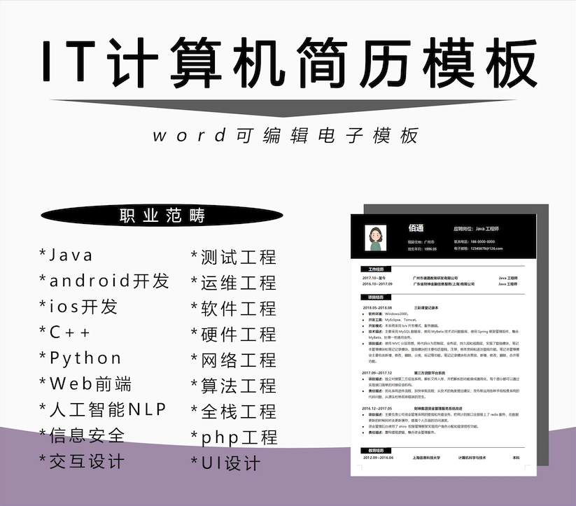
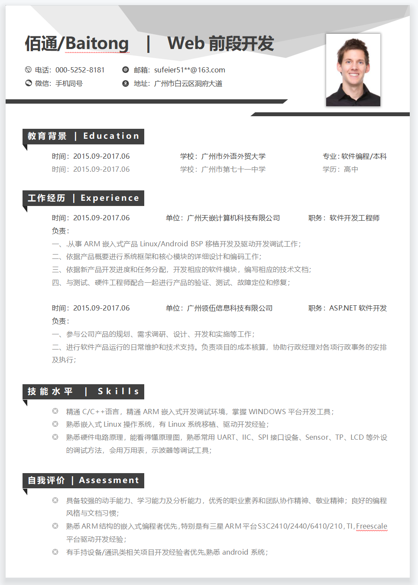
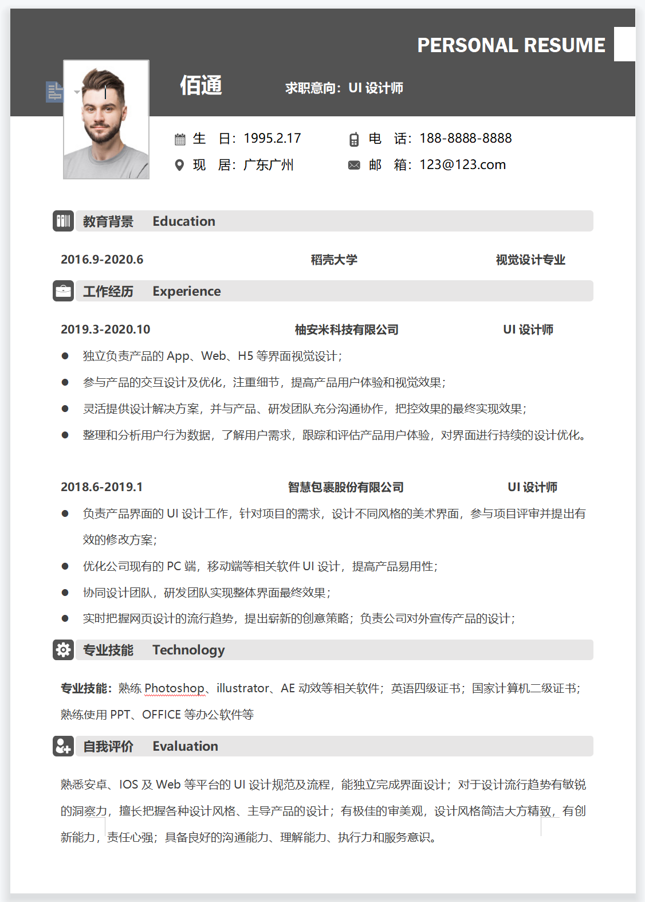
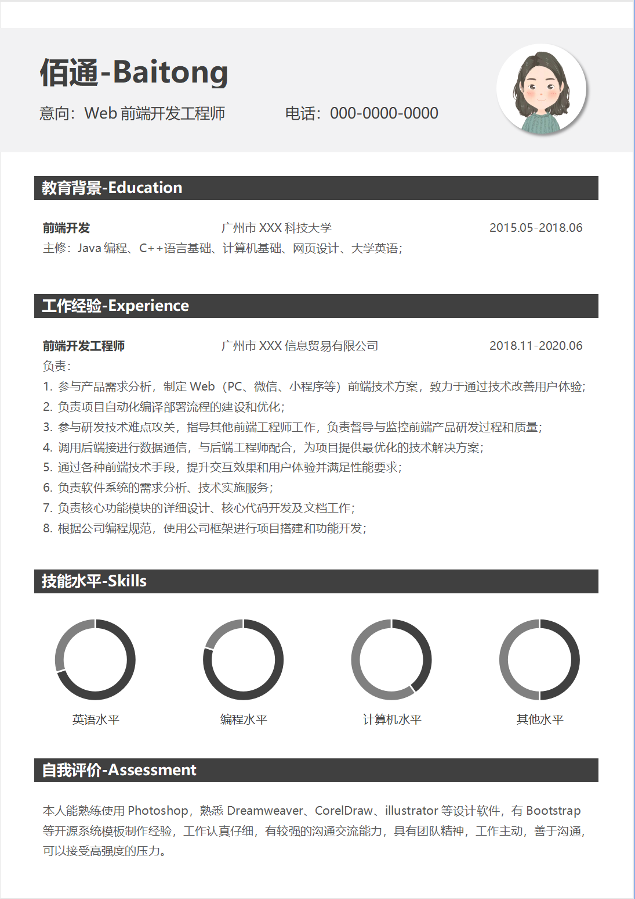
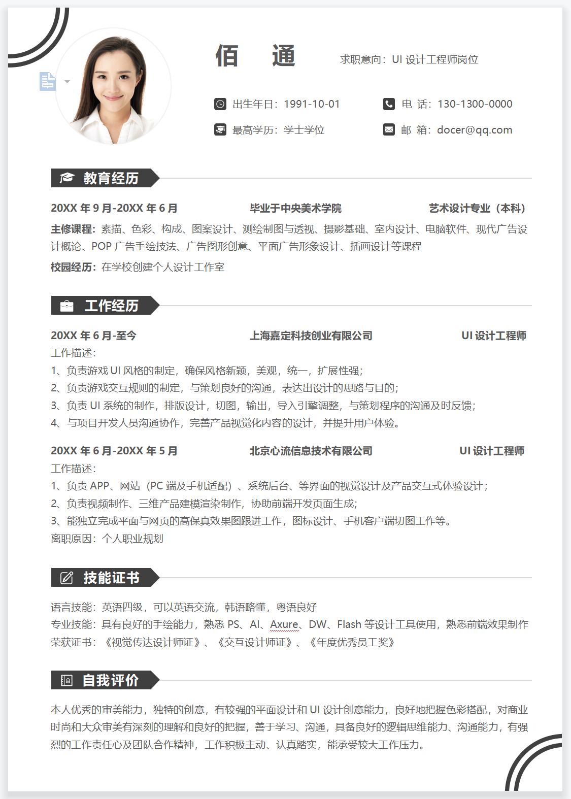
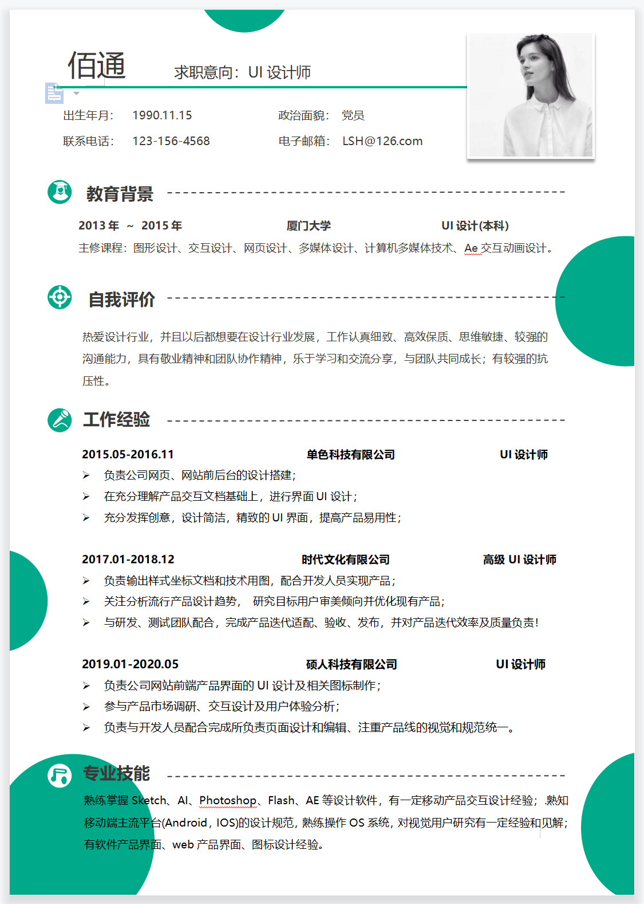

# IT计算机简历模板

* Java交互
* Jandroid安卓
* ios开发
* 运维
* Web
* 测试
* UI

---

* 支持预览
* 包含Word源文件
* 多职业选择

---

- [🔰 github 仓库地址](https://github.com/ytlyy1773/curriculum-vitae.git)
- [🔰 gitee 仓库地址](https://gitee.com/ytlyy1773/curriculum-vitae.git)

## 简历模版概要

## 优秀简历展示

## 作者博客

- [🚗 博客官网](https://www.jwblog.cn/)

## 打赏作者

- [🚗 直达赞助](https://www.jwblog.cn/oneself/contactInformation.html)
